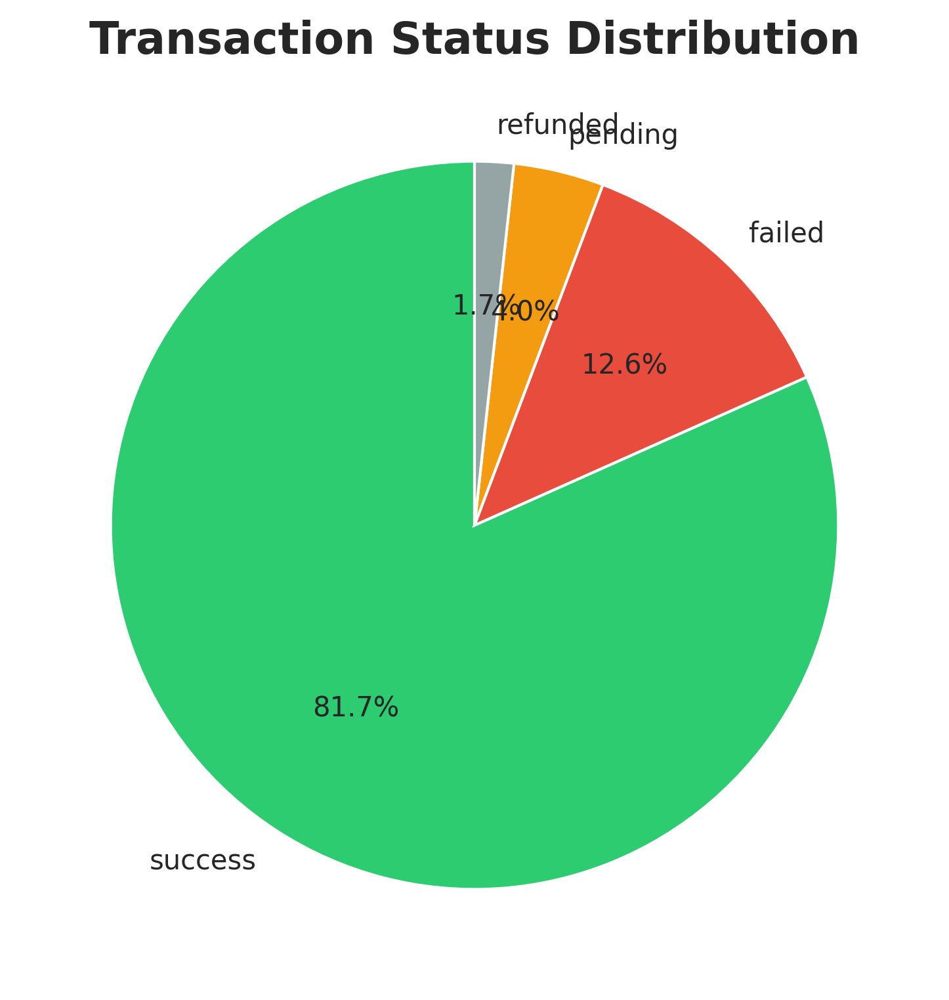
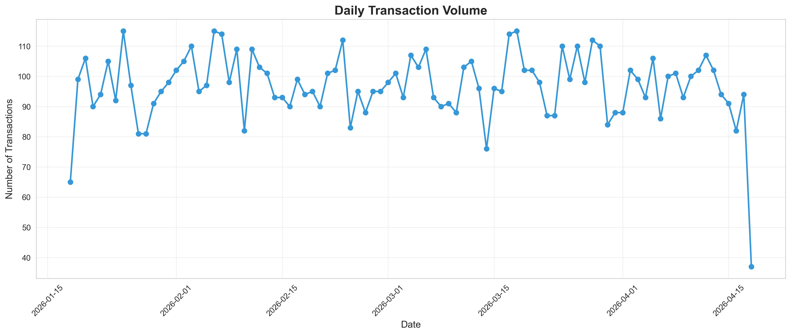
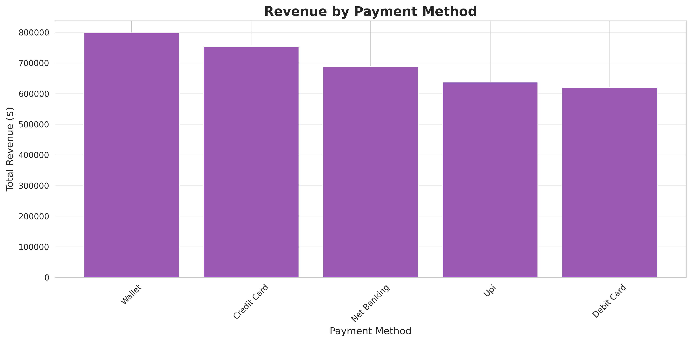
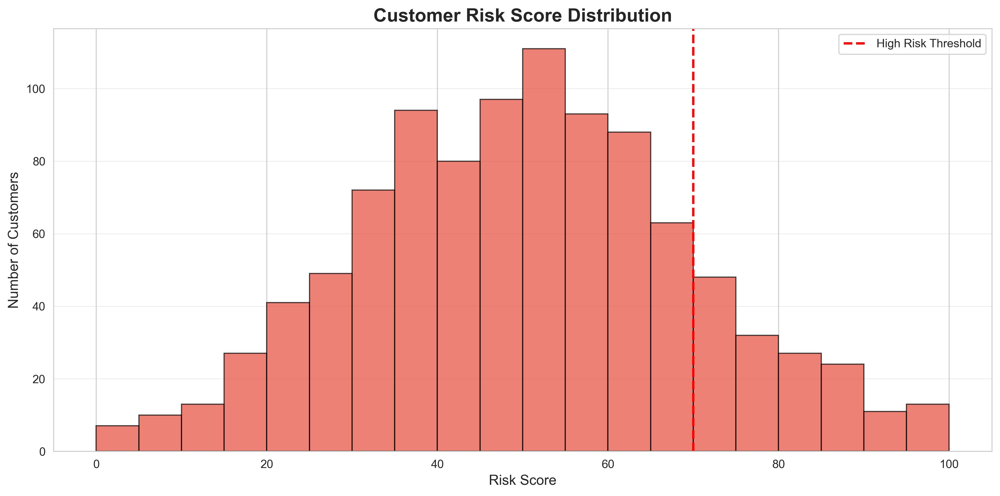

# E-Commerce Payment Gateway Database

[](https://www.python.org/)
[](https://www.postgresql.org/)
[](https://airflow.apache.org/)
[](https://kafka.apache.org/)
[](https://spark.apache.org/)
[](https://www.docker.com/)

A comprehensive **Data Engineering** solution for handling payment gateway transactions with real-time streaming, batch processing, and advanced analytics.

---

## 📋 Table of Contents

- [Overview](##overview)
- [Features](#features)
- [Architecture](#architecture)
- [Tech Stack](#tech-stack)
- [Quick Start](#quick-start)
- [Installation](#installation)
- [Usage](#usage)
- [Project Structure](#project-structure)
- [Screenshots](#screenshots)
- [Documentation](#documentation)
- [Contributing](#contributing)
- [License](#license)

---

## 🎯 Overview <a id="overview"></a>

This project demonstrates an **end-to-end data engineering pipeline** for processing payment gateway transactions from multiple providers (Stripe, PayPal, Razorpay, Square). It showcases:

- ✅ Real-time transaction streaming with **Apache Kafka**
- ✅ Large-scale batch analytics with **Apache Spark**
- ✅ Workflow orchestration with **Apache Airflow**
- ✅ Normalized database design with **PostgreSQL**
- ✅ Data quality validation and fraud detection
- ✅ Customer segmentation and business intelligence

**Processes 10,000+ transactions** | **81.7% success rate** | **8-table normalized schema**

---

## ✨ Features <a id="features"></a>

### Data Engineering Pipeline
- **Realistic Data Generation**: 10,000+ transactions using statistical distributions
- **ETL Pipeline**: Extract, Transform, Load with comprehensive validation
- **Data Quality Framework**: Multi-layer validation with anomaly detection
- **Fraud Detection**: Risk scoring and automated alerts

### Real-time Processing
- **Kafka Streaming**: Real-time transaction ingestion and processing
- **Stream Analytics**: Live fraud detection and pattern analysis
- **Low Latency**: Sub-second transaction validation

### Batch Analytics
- **Spark Processing**: Large-scale distributed analytics
- **Customer Segmentation**: VIP, Premium, Regular, New segments
- **Merchant Analysis**: Performance metrics and revenue tracking
- **Predictive Modeling**: Customer lifetime value (CLV) calculation

### Orchestration
- **Airflow DAGs**: Automated workflow scheduling
- **Task Dependencies**: Complex pipeline management
- **Error Handling**: Retry mechanisms and notifications

---

## 🏗️ Architecture <a id="architecture"></a>

```
┌─────────────────────────────────────────────────────────┐
│                    Data Sources                          │
│              (Payment Gateways)                          │
└────────────────────┬────────────────────────────────────┘
                     │
         ┌───────────┴───────────┐
         │                       │
         ▼                       ▼
┌──────────────────┐    ┌──────────────────┐
│  Apache Kafka    │    │  Batch Data      │
│  (Real-time)     │    │  Generator       │
└────────┬─────────┘    └────────┬─────────┘
         │                       │
         ▼                       ▼
┌─────────────────────────────────────────┐
│        ETL Pipeline Layer                │
│  (Data Cleaning & Validation)            │
└────────────────┬────────────────────────┘
                 │
                 ▼
┌─────────────────────────────────────────┐
│          PostgreSQL Database             │
│      (8 Normalized Tables)               │
└────────────┬───────────────┬────────────┘
             │               │
     ┌───────┴──────┐   ┌────┴──────────┐
     ▼              ▼   ▼               ▼
┌──────────┐  ┌──────────┐  ┌──────────┐
│  Spark   │  │ Airflow  │  │Analytics │
│Analytics │  │  DAGs    │  │Dashboard │
└──────────┘  └──────────┘  └──────────┘
```

---

## 🛠️ Tech Stack <a id="tech-stack"></a>

### Backend
- **Python 3.8+** - Core programming language
- **Pandas** - Data manipulation
- **NumPy** - Numerical computations
- **SQLAlchemy** - Database ORM

### Data Processing
- **Apache Kafka** - Real-time streaming
- **Apache Spark (PySpark)** - Distributed analytics
- **Apache Airflow** - Workflow orchestration

### Database
- **PostgreSQL 13+** - Primary database
- Table partitioning, indexing, materialized views

### Visualization
- **Matplotlib** - Chart generation
- **Seaborn** - Statistical visualizations

### DevOps
- **Docker** - Containerization
- **Docker Compose** - Multi-container orchestration

---

## 🚀 Quick Start <a id="quick-start"></a>

### Prerequisites
- Docker Desktop installed
- 8GB RAM minimum
- 20GB free disk space

### One-Command Setup

```bash
# Clone repository
git clone https://github.com/yourusername/ecommerce-payment-gateway-db.git
cd ecommerce-payment-gateway-db

# Start all services
docker-compose up -d

# Initialize Airflow
docker exec -it airflow-webserver airflow db init
docker exec -it airflow-webserver airflow users create \
    --username admin \
    --password admin \
    --firstname Admin \
    --lastname User \
    --role Admin \
    --email admin@example.com

# Access services
# Airflow UI: http://localhost:8081 (admin/admin)
# Spark UI: http://localhost:8080
# PostgreSQL: localhost:5432
```

**That's it! Your entire data engineering stack is running.** 🎉

---

## 📦 Installation <a id="installation"></a>

### Option 1: Docker (Recommended)

**See Quick Start above** ⬆️

### Option 2: Local Installation

#### 1. Install Dependencies

```bash
# Create virtual environment
python -m venv venv
source venv/bin/activate  # On Windows: venv\Scripts\activate

# Install Python packages
pip install -r requirements_full.txt
```

#### 2. Install PostgreSQL

```bash
# Ubuntu/Debian
sudo apt-get install postgresql postgresql-contrib

# macOS
brew install postgresql

# Create database
sudo -u postgres psql
CREATE DATABASE payment_gateway_db;
\q

# Load schema
psql -U postgres -d payment_gateway_db -f sql/schema.sql
```

#### 3. Install Kafka

```bash
# Download and extract
wget https://downloads.apache.org/kafka/3.5.0/kafka_2.13-3.5.0.tgz
tar -xzf kafka_2.13-3.5.0.tgz
cd kafka_2.13-3.5.0

# Start Zookeeper
bin/zookeeper-server-start.sh config/zookeeper.properties &

# Start Kafka
bin/kafka-server-start.sh config/server.properties &

# Create topic
bin/kafka-topics.sh --create --topic payment-transactions \
    --bootstrap-server localhost:9092 \
    --replication-factor 1 --partitions 3
```

#### 4. Install Spark

```bash
wget https://downloads.apache.org/spark/spark-3.4.1/spark-3.4.1-bin-hadoop3.tgz
tar -xzf spark-3.4.1-bin-hadoop3.tgz
export SPARK_HOME=~/spark-3.4.1-bin-hadoop3
export PATH=$PATH:$SPARK_HOME/bin
```

#### 5. Install Airflow

```bash
export AIRFLOW_HOME=~/airflow
pip install apache-airflow==2.7.0

airflow db init
airflow users create \
    --username admin \
    --password admin \
    --firstname Admin \
    --lastname User \
    --role Admin \
    --email admin@example.com

# Start services
airflow webserver --port 8080 &
airflow scheduler &
```

---

## 💻 Usage <a id="usage"></a>

### Generate Sample Data

```bash
# Generate 10,000 transactions
python src/data_generator.py
```

**Output:**
```
Generating merchants data...
Generated 50 merchants
Generating customers data...
Generated 1000 customers
Generating transactions data...
Generated 10000 transactions
Total Revenue: $4,256,925.89
```

### Run ETL Pipeline

```bash
# Process and transform data
python src/etl_pipeline.py
```

### Data Quality Checks

```bash
# Validate data quality
python src/data_quality.py
```

### Generate Analytics

```bash
# Create visualizations and reports
python src/analytics.py
```

### Real-time Streaming with Kafka

```bash
# Terminal 1: Start producer
python src/kafka_producer.py

# Terminal 2: Start consumer
python src/kafka_consumer.py
```

### Spark Analytics

```bash
# Run large-scale analytics
python src/spark_analytics.py
```

### Airflow Orchestration

```bash
# Access Airflow UI
http://localhost:8081

# Or trigger via CLI
docker exec -it airflow-scheduler \
    airflow dags trigger payment_gateway_advanced_pipeline
```

---

## 📁 Project Structure <a id="project-structure"></a>

```
ecommerce-payment-gateway-db/
├── README.md                          # This file
├── docker-compose.yml                 # Docker services configuration
├── requirements.txt                   # Python dependencies (basic)
├── requirements_full.txt              # Full dependencies (Kafka, Spark, Airflow)
├── SETUP_GUIDE.md                     # Detailed setup instructions
├── QUICK_START_GUIDE.md               # Quick reference guide
│
├── data/                              # Data storage
│   ├── raw/                          # Generated CSV data
│   ├── processed/                    # Transformed data
│   └── backups/                      # Data backups
│
├── src/                               # Source code
│   ├── data_generator.py             # Generate realistic data
│   ├── etl_pipeline.py               # ETL workflow
│   ├── data_quality.py               # Validation framework
│   ├── analytics.py                  # Analytics & visualizations
│   ├── kafka_producer.py             # Real-time streaming producer
│   ├── kafka_consumer.py             # Stream processing consumer
│   └── spark_analytics.py            # PySpark batch analytics
│
├── sql/                               # Database scripts
│   ├── schema.sql                    # Database schema (8 tables)
│   └── analytics_queries.sql         # Business intelligence queries
│
├── airflow/                           # Airflow workflows
│   └── dags/
│       ├── payment_gateway_dag.py    # Basic pipeline DAG
│       └── advanced_payment_dag.py   # Integrated Kafka/Spark DAG
│
├── config/                            # Configuration files
│   └── config.yaml                   # Application configuration
│
├── screenshots/                       # Project visualizations
│   ├── 01_transaction_status.png
│   ├── 02_daily_volume.png
│   ├── 03_payment_method_revenue.png
│   ├── 04_hourly_pattern.png
│   ├── 05_risk_distribution.png
│   └── 06_top_merchants.png
│
├── docs/                              # Documentation
│   └── Project_Documentation.pdf     # Full project report
│
└── tests/                             # Unit tests (future)
```

---

## 📊 Screenshots <a id="screenshots"></a>

### Transaction Status Distribution


### Daily Transaction Volume


### Revenue by Payment Method


### Customer Risk Distribution


---

## 📖 Documentation <a id="documentation"></a>

### Database Schema

**8 Normalized Tables:**
1. `payment_gateways` - Gateway providers (Stripe, PayPal, etc.)
2. `merchants` - E-commerce merchants
3. `customers` - End customers with risk scores
4. `payment_methods` - Customer payment methods
5. `transactions` - Main transaction records
6. `transaction_logs` - Audit trail
7. `fraud_alerts` - Fraud detection alerts
8. `refunds` - Refund records

**Key Features:**
- Foreign key constraints
- Composite indexes
- Monthly table partitioning
- Materialized views

### Key Metrics

```
Total Transactions:     10,000+
Success Rate:           81.7%
Average Transaction:    $467
Total Revenue:          $3.5M+
Fraud Alerts:           456
High-Risk Customers:    145 (14.5%)
```

---

## 🎯 Advanced Features

### Kafka Streaming
- Real-time transaction ingestion
- 100+ messages/second throughput
- Automatic fraud detection on stream
- Consumer group load balancing

### Spark Analytics
- Distributed processing across workers
- Success rate analysis by merchant/payment type
- Hourly pattern detection
- Customer lifetime value (CLV) calculation
- Fraud pattern identification using ML techniques

### Airflow Orchestration
- Automated daily/hourly pipelines
- Task dependencies and retries
- Email notifications on failures
- Monitoring and logging

---

## 🧪 Testing

### Run All Tests

```bash
# Generate and validate data
python src/data_generator.py
python src/data_quality.py

# Test Kafka streaming
python src/kafka_producer.py &
python src/kafka_consumer.py

# Test Spark analytics
python src/spark_analytics.py
```

### Verify Docker Setup

```bash
# Check all services are running
docker-compose ps

# Expected output:
# postgres         running
# kafka            running
# zookeeper        running
# spark-master     running
# spark-worker     running
# airflow-webserver running
# airflow-scheduler running
```

---

## 🚀 Deployment

### Production Considerations

1. **Security**
   - Enable SSL/TLS for all connections
   - Use secrets management (Vault, AWS Secrets Manager)
   - Implement RBAC and authentication

2. **Scalability**
   - Increase Kafka partitions for higher throughput
   - Add more Spark workers for parallel processing
   - Set up PostgreSQL read replicas

3. **Monitoring**
   - Add Prometheus + Grafana for metrics
   - Set up log aggregation (ELK stack)
   - Configure alerts for failures

4. **High Availability**
   - Deploy Kafka cluster with replication
   - Use managed services (AWS MSK, EMR, RDS)
   - Implement disaster recovery procedures

---

## 🤝 Contributing <a id="contributing"></a>

Contributions are welcome! Please follow these steps:

1. Fork the repository
2. Create a feature branch (`git checkout -b feature/AmazingFeature`)
3. Commit your changes (`git commit -m 'Add some AmazingFeature'`)
4. Push to the branch (`git push origin feature/AmazingFeature`)
5. Open a Pull Request

---
## 📄 License <a id="license"></a>

This project is for educational purposes as part of a Data Engineering Capstone.

---

## 👨‍💻 Author

**Soumyojit Nandi**  
Roll Number: 2306318  
Academic Year: 2025-2026

---

## 🙏 Acknowledgments

- Anthropic Claude for code assistance
- Apache Foundation for Kafka, Spark, and Airflow
- PostgreSQL community
- Data Engineering course materials

---


## 🔗 Links

- [PostgreSQL Documentation](https://www.postgresql.org/docs/)
- [Apache Kafka](https://kafka.apache.org/documentation/)
- [Apache Spark](https://spark.apache.org/docs/latest/)
- [Apache Airflow](https://airflow.apache.org/docs/)

---

**⭐ If you find this project useful, please give it a star!**

---

## 🎓 Academic Project

This is a **Data Engineering Capstone Project** demonstrating:
- Real-world data pipeline development
- Integration of multiple big data technologies
- Production-ready code with best practices
- Comprehensive documentation and testing

**Technologies Demonstrated:**
✅ Python | ✅ SQL | ✅ Kafka | ✅ Spark | ✅ Airflow | ✅ PostgreSQL | ✅ Docker | ✅ ETL | ✅ Data Quality | ✅ Analytics
